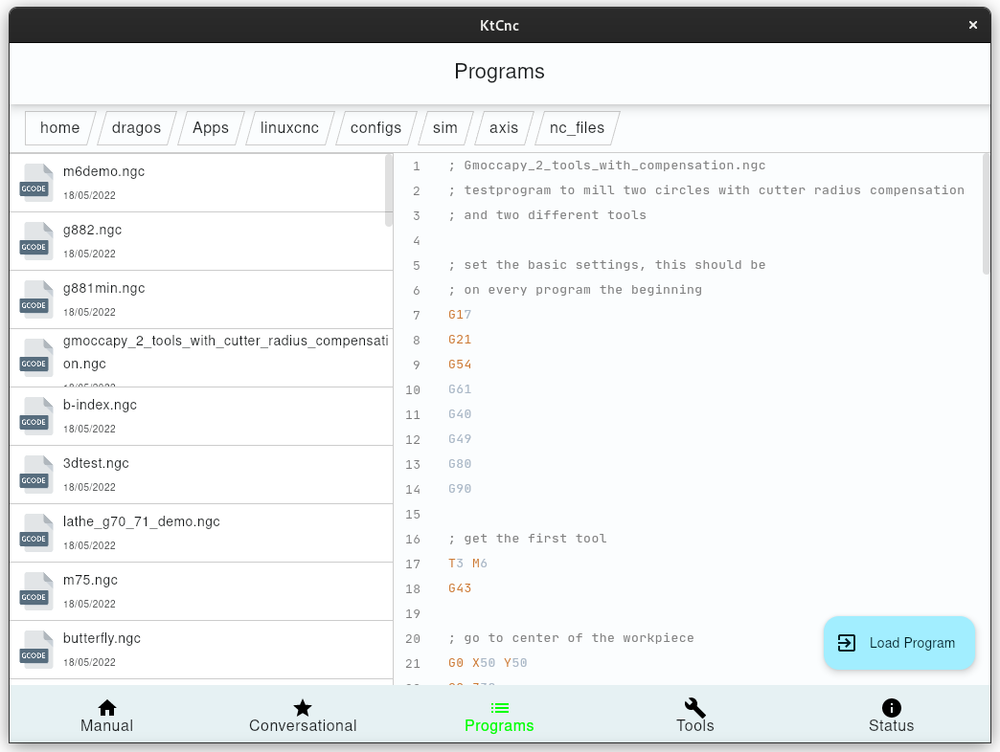
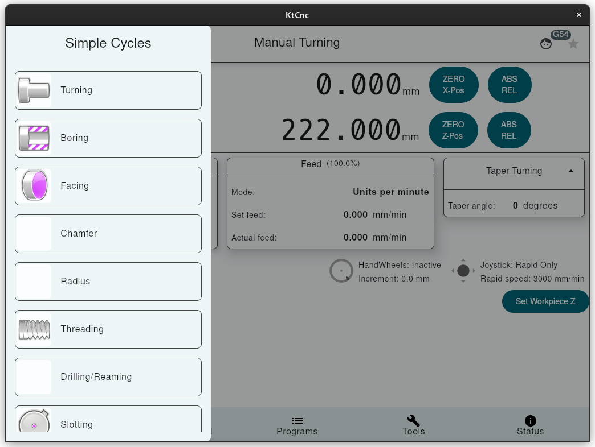
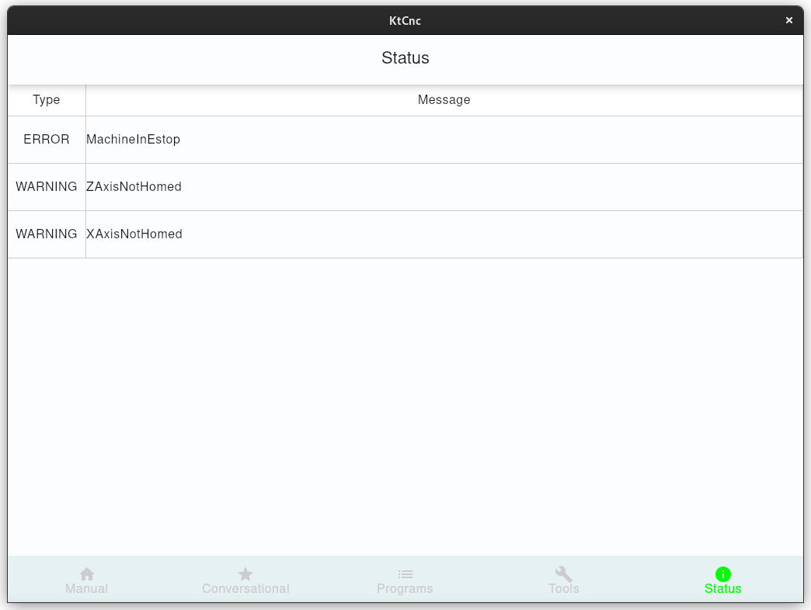
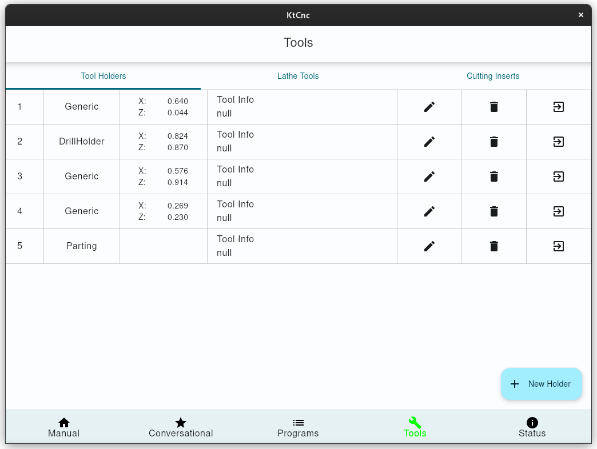
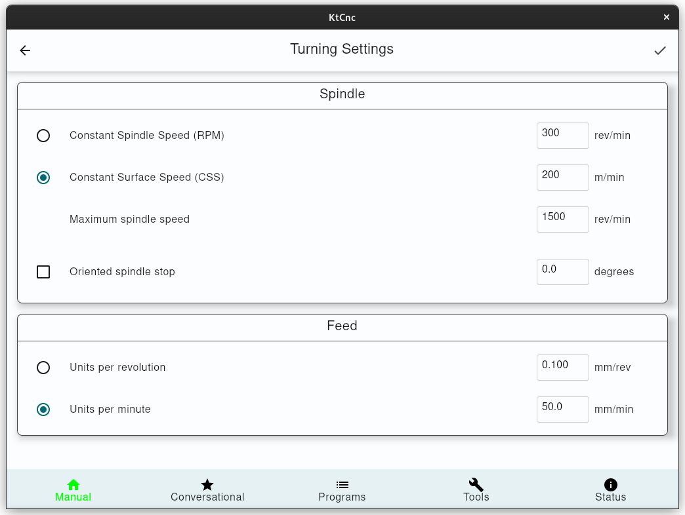

# MindOverCNC Lathe 

## About

I own a Weiler E30 Lathe, built in 1993, that originally had a Sinumerik 805 controller, with some Weiler flavors on top of it. 
The Weiler's UI was enhancing the usage of the lathe with a few predefined called Simple Cycles, for operations like: 
cutting tapers, radii, thread reliefs, among the default cycles for ID/OD turning, threading or drilling.
The HMI of that controller was a membrane keyboard and a 640x480 display.

The purpose of this project is to create a modern, touch screen based solution, for operating this lathe.
The display used is a Iiyama ProLite TF1215MC-B1 12" with a resolution of 1024x768px.
At least for now, the UI is made for this resolution. On higher resolutions it will scale, on smaller resolutions, 
it might not fit. 

Due to the environment in which this application will run, it was designed to be used without a mouse or keyboard that can collect metal chips or coolant. 
All the numeric inputs will be done from the touch screen. 

The controller relies on two sources of inputs. 
1. The touch screen (that emulates a mouse pointer input)
2. The physical buttons & handwheels on the apron of the machine and the spindle switch lever.

In order to maintain the UI cleanliness & logic, the UI does not contain actions for the physical buttons that are present on the machine: 
These include: E-Stop, Enable, Cycle Start, Cycle Stop, Spindle FWD/REV/STOP, Feed Override, Spindle Override, Joystick functions for jogging or feeding.
The software will take all these physical inputs into account, but they are displayed in a read-only manner.

## Dependencies

This project depends on a 3rd party library, that handles the communication with LinuxCnc library: https://github.com/dragossusi/ktlcnc

Follow the instructions there to build the library that this project depends on.

## Hal Pins

In order to have this software interact with the physical world (button presses, relays), this application relies on some custom defined input/output hal pins.
Because these pins are defined in the software, the software need to run before they become available.
Therefore, these pins can be used only in postgui_hal files, because those files are executed after the UI was created.

## Build

Set the required arguments in `gradle.properties` **or** environment variables.

| Env           | Property      | Description                |
|---------------|---------------|----------------------------|
| LINUXCNC_HOME | linuxcnc.home | The linuxcnc home folder   |
| LINUXCNC_JDK  | linuxcnc.jdk  | The jdk to be used for JNI |

[//]: # (| VTK_JAR       | vtk.jar       | Path to vtk.jar            |)

[//]: # (| VTK_LIB       | vtk.lib       | Path to vtk so files       |)

TODO

## Run the app

At least while in the development phase, in order to run the app, you will need to have the linuxcnc running in the background.
This is because this app will use the same NML channels & it will read the memory buffers that LinuxCnc is using to interact with the UI.
That means that any postgui.hal files will have to be executed manually. 

Run using gradle(you need to specify an ini file to run):

```shell
./gradlew run --args="configs/sim/axis/lathe.ini"
```

Other arguments:

| command | description                |
|---------|----------------------------|
| tb      | disable system top app bar |

## Usage

TODO

## Screenshots

[](preview/numpad.png)

[](preview/programs.png)

[](preview/simple_cycles.png)

[](preview/status.png)

[](preview/tools_holders.png)

[](preview/turning_settings.png)